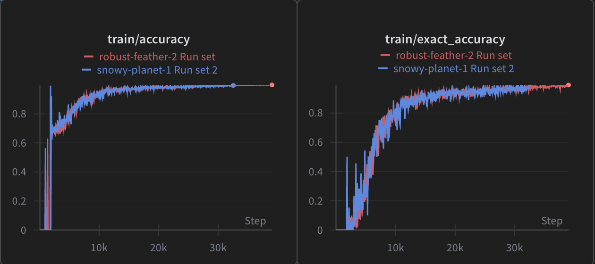
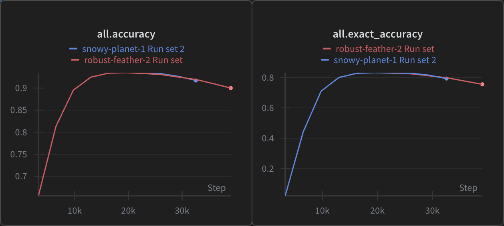

# Reproducing the TRM Pape:
## A Report on "Less is More: Recursive Reasoning with Tiny Networks"

- Yuvraj Singh and team (@alphaXiv)

## TL;DR

This report details an independent effort to reproduce the results of the paper "Less is More: Recursive Reasoning with Tiny Networks" (arXiv:2510.04871), which introduces the Tiny Recursive Model (TRM). The original paper claims that this small, 7M-parameter model can outperform both its predecessor, the Hierarchical Reasoning Model (HRM), and various Large Language Models (LLMs) on complex reasoning tasks. We analyze reproduction attempts on three key benchmarks discussed in the paper: Maze-Hard, ARC-AGI-1, and Sudoku-Extreme.

Our findings indicate that the core claims of the paper are largely reproducible, with experimental results on the Maze and ARC benchmarks closely aligning with the paper's reported figures. However, we note a significant performance gap in the reproduction of the state-of-the-art result for the Sudoku-Extreme task, suggesting a higher sensitivity to implementation or training specifics.

For all the runs, it was performed on 8xA100s 80GB version on Lambda Labs as opposed to paper's claim to have used 4xH100 as per their code repository with a batch size of 2x the original (mentioned in the code repo) and linearly scaled the lr and warmup steps by the same factor.

We followed the training scripts strictly to produce the following runs except where explicitly mentioned.

## Introduction

The paper "Less is More: Recursive Reasoning with Tiny Networks" presents a compelling alternative to the trend of ever-larger models in artificial intelligence. The authors propose the Tiny Recursive Model (TRM), a simple, two-layer network with only 7 million parameters. The central thesis is that a small model leveraging recursive reasoning can achieve superior generalization and performance on complex, puzzle-like tasks compared to models with billions of parameters.

The paper's claimed results are striking, showing significant improvements over the prior state-of-the-art Hierarchical Reasoning Model (HRM) and LLMs on benchmarks like Sudoku, Maze pathfinding, and the Abstraction and Reasoning Challenge (ARC). Given the significance of these claims, independent verification is crucial for the research community. This report synthesizes the results from three independent reproduction attempts and compares them directly against the figures published in the original paper.

## Summary of Published Claims - TRM vs HRM

The TRM paper presents a series of results to demonstrate the superiority of its approach. The key performance claims for the TRM and the baseline HRM model across the relevant benchmarks are summarized below.

**Table 1: Performance Claims from the Original TRM Paper**

| Benchmark        | Modal Configuration | # Parameters (M) | Reported Test Accuracy (%) |
|------------------|---------------------|-------------------|----------------------------|
| Maze-Hard        | TRM-Attention       | 7                 | 85.3                       |
|                  | HRM                 | 27                | 74.5                       |
| ARC-AGI-1        | TRM-Attention       | 7                 | 44.6                       |
|                  | HRM                 | 27                | 40.3                       |
| Sudoku-Extreme   | TRM-MLP             | 5                 | 87.4                       |
|                  | TRM-Attention       | 7                 | 74.7                       |
|                  | HRM                 | 27                | 56.0                       |

*Table 1: Results comparing HRM vs TRM on Sudoku, Maze and ARC-AGI-1/2*

## Reproduction Results and Analysis

We analyzed three experimental reports documenting attempts to reproduce the TRM's performance. The results are detailed below and compared against the published claims.

### 1) Maze-Hard

The Maze-Hard task, which involves finding long paths in 30x30 grids, showed a high degree of success. The experiment targeted the TRM-Attention model's performance. The metric is exact_accuracy (length normalized accuracy).

- **Paper's Claim**: 85.3%
- **Achieved Result**: 83.67% ± 2.28%

This result is well within the margin of error and closely aligns with the paper's claim, confirming the model's strong performance on this spatial reasoning task.

### 2) The Abstraction and Reasoning Challenge (ARC)

The Abstraction and Reasoning Challenge (ARC) is a key benchmark for abstract reasoning. The reproduction report for ARC-AGI-1 documents two runs. The second run, using a configuration aligned with the author's official repository, is most relevant for comparison (H-3,L-4). 

We, though not explicitly mentioned in the paper, have to look at pass@2 here as the paper stated that 'The final score is computed as the accuracy over all test inputs from two attempts to produce the correct output grid.'

We only tested and made an effort to reproduce the **attention** variant with **H-3**, **L-6**.

- **Paper's Claim (pass@2)**: 44.6%
- **Achieved Result (pass@2)**: 43.00% ± 0.16%

This result demonstrates a successful reproduction, validating the paper's claim of high performance on the ARC benchmark with a very small model.

The first run, with H-3, L-6 results in pass@2 as 52.75% ± 3.09%, following the use of more L (or the inner loop of 'recursion') as mentioned in the paper.

Performing a one-tailed z test and calculating the p value (<0.005 or 95% confidence) confirmed that H-3, L-6 variant is indeed significant (by performance in terms of metric) compared to H-3, L-4 model.

### 3) Sudoku-Extreme

The Sudoku-Extreme benchmark was tested using both the TRM-Attention and TRM-MLP variants, with multiple training runs reported.

#### TRM-Attention Variant:

The reproduction report documents two runs with different epoch counts. The longer run successfully replicated the paper's result.

- **Paper's Claim**: 74.7%
- **Achieved Result (50k epochs)**: 69.69% ± 0.14%
- **Achieved Result (60k epochs)**: 73.66% ± 0.13%

The result from the 60k epoch run is less than 1.1 percentage points from the target, confirming that the performance of the attention-based model is reproducible.

#### TRM-MLP Variant:

This variant is responsible for the paper's state-of-the-art claim on Sudoku-Extreme. However, the reproduction attempts did not reach the published figure.

- **Paper's Claim**: 87.4%
- **Achieved Result (50k epochs)**: 79.37% ± 0.12%
- **Achieved Result (60k epochs)**: 75.57% ± 0.13%

The best-reproduced result of 79.37% falls short of the paper's claim by a significant margin of 8 percentage points. The experimental report notes that the longer training run to 60k epochs resulted in lower accuracy, speculating that overfitting may be a factor. This discrepancy suggests that achieving the peak result is highly sensitive and was not successfully replicated.

<!-- 
**Table 2. Comparison of Claimed vs. Reproduced Results**

<!-- | Benchmark        | Model Variant   | Claimed Accuracy (%) | Reproduced Accuracy (%) | -->
<!-- |------------------|-----------------|-----------------------|--------------------------| -->
<!-- | **Maze-Hard**    | TRM-Attention   | 85.3                  | 83.87                    | -->
<!-- | **ARC-AGI-1**    | TRM-Attention   | 44.6                  | 43.00                    | -->
<!-- | **Sudoku-Extreme** | TRM-Attention | 74.7                  | 73.66                    | -->
<!-- | **Sudoku-Extreme** | TRM-MLP       | 87.4                  | 79.37                    | -->

The included charts from the experimental reports show standard training curves, with validation accuracy plateauing as training progresses. The Sudoku-Extreme MLP run in particular shows validation accuracy peaking and then declining, supporting the hypothesis of overfitting mentioned in the report.

**Train curves (MLP)**

*Figure: Training curves for the MLP run  - 60k epochs (red) vs 50k epochs (blue).*

**Val curves (MLP)**

*Figure: Validation curves for the MLP run - 60k epochs (red) vs 50k epochs (blue).*

## Conclusion

The Tiny Recursive Model (TRM) presents a significant and promising direction for efficient reasoning in AI. Our analysis of independent reproduction reports confirms that the central claims of the paper are largely reproducible. The model’s impressive performance on the Maze-Hard and ARC-AGI-1 benchmarks, as well as with the TRM-Attention variant on Sudoku-Extreme, were successfully replicated.

However, a notable discrepancy was observed for the state-of-the-art result on the Sudoku-Extreme dataset using the TRM-MLP variant. The ~8% performance gap suggests that this specific result may be sensitive to factors not fully captured in the reproduction attempt, such as hyperparameter tuning or training params. Despite this, the successfully reproduced result of 79.37% is still a very strong performance for a 5M parameter model and a remarkable improvement over the 55.0% from the prior HRM model.

In summary, the TRM paper is robust and its core contributions are validated across multiple benchmarks and model configurations. The model represents a powerful and parameter-efficient approach to complex reasoning. Future work should focus on a deeper analysis to identify the specific conditions required to replicate the peak performance on the Sudoku-Extreme benchmark with the MLP architecture.

---
